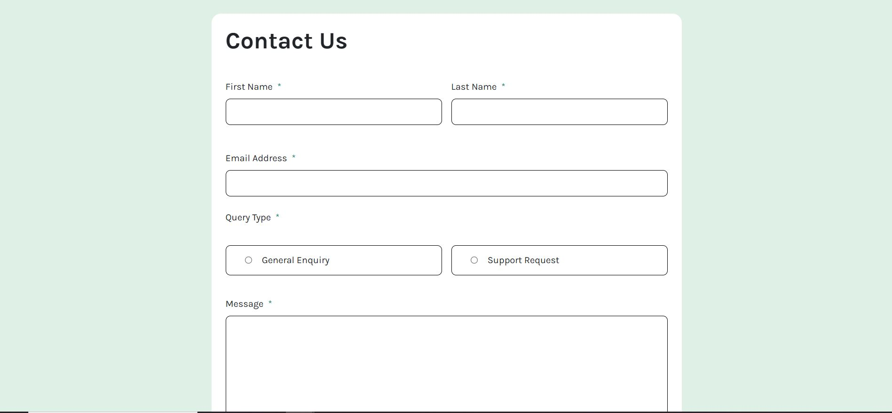

# Frontend Mentor - Contact form solution

This is a solution to the [Contact form challenge on Frontend Mentor](https://www.frontendmentor.io/challenges/contact-form--G-hYlqKJj). Frontend Mentor challenges help you improve your coding skills by building realistic projects.

## Table of contents

- [Overview](#overview)
  - [The challenge](#the-challenge)
  - [Screenshot](#screenshot)
  - [Links](#links)
- [My process](#my-process)
  - [Built with](#built-with)
  - [What I learned](#what-i-learned)
  - [Continued development](#continued-development)
  - [Useful resources](#useful-resources)
- [Author](#author)

## Overview

### The challenge

Users should be able to:

- Complete the form and see a success toast message upon successful submission
- Receive form validation messages if:
  - A required field has been missed
  - The email address is not formatted correctly
- Complete the form only using their keyboard
- Have inputs, error messages, and the success message announced on their screen reader
- View the optimal layout for the interface depending on their device's screen size
- See hover and focus states for all interactive elements on the page

### Screenshot

### Links

- Solution URL: [Github](https://github.com/abigailjulie/FrontendMentor_ContactForm)
- Live Site URL: [Live Site](https://frontendmentorcontactform.vercel.app/)

## My process

### Built with

- Semantic HTML5 markup
- CSS custom properties
- Flexbox
- CSS Grid
- Mobile-first workflow
- Bootstrap
- ADA
- JavaScript

### What I learned

I ws able to applied some accessibilty practices to this form. I practiced changing the color of the outline based on whether something was selected or not. I also learned about triggering error messages for blank input.

### Continued development

I really like creating a dynamic interface that has client-side feedback for correct and incorrect inputs. I'd like to practice focusing on an area with a mistake. I was able to complete it here but I'm not sure how that happened. Making websites more accessible seems really fun.

### Useful resources

- [Bootstrap](https://getbootstrap.com/docs/5.3/forms/overview/)
- [Native Form Controls](https://developer.mozilla.org/en-US/docs/Learn_web_development/Extensions/Forms/Basic_native_form_controls)
- [Labling Controls](https://www.w3.org/WAI/tutorials/forms/labels/)
- [Grouping Controls](https://www.w3.org/WAI/tutorials/forms/grouping/)
- [Form Instructions](https://www.w3.org/WAI/tutorials/forms/instructions/)
- [Autocomplete](https://developer.mozilla.org/en-US/docs/Web/HTML/Attributes/autocomplete)
- [Keyboard Accessibility](https://design.homeoffice.gov.uk/accessibility/forms/keyboard)
- [Validating Input](https://www.w3.org/WAI/tutorials/forms/validation/)
- [Indicating Forms](https://www.accessibility-developer-guide.com/examples/forms/)
- [Accessible Forms](https://www.deque.com/blog/anatomy-of-accessible-forms-required-form-fields/)
- [Inclusive Outputs](https://www.ovl.design/text/inclusive-inputs/)
- [Learn Outputs](https://web.dev/learn/forms)
- [Form Outputs](https://www.w3.org/WAI/tutorials/forms/)
- [Forms](https://www.accessibility-developer-guide.com/examples/forms/)

## Author

- Website - [Abigail Figaro](https://www.abigaildesigns.org)
- Frontend Mentor - [@abigailjulie](https://www.frontendmentor.io/profile/abigailjulie)
